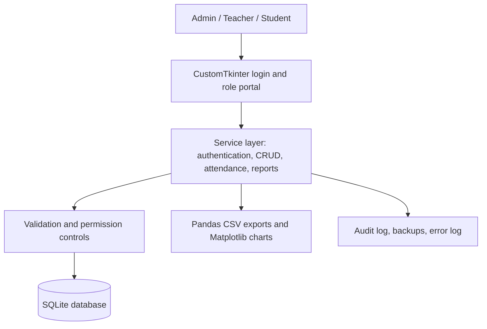

# System Architecture Flowchart

```mermaid
flowchart TD
    U[Admin / Teacher / Student] --> L[CustomTkinter login and role portal]
    L --> S[Service layer: authentication, CRUD, attendance, reports]
    S --> V[Validation and permission controls]
    V --> D[(SQLite database)]
    S --> R[Pandas CSV exports and Matplotlib charts]
    S --> B[Audit log, backups, error log]
```

The presentation layer does not write SQL. Services enforce business rules before `database/db.py` opens parameterized SQLite transactions.
